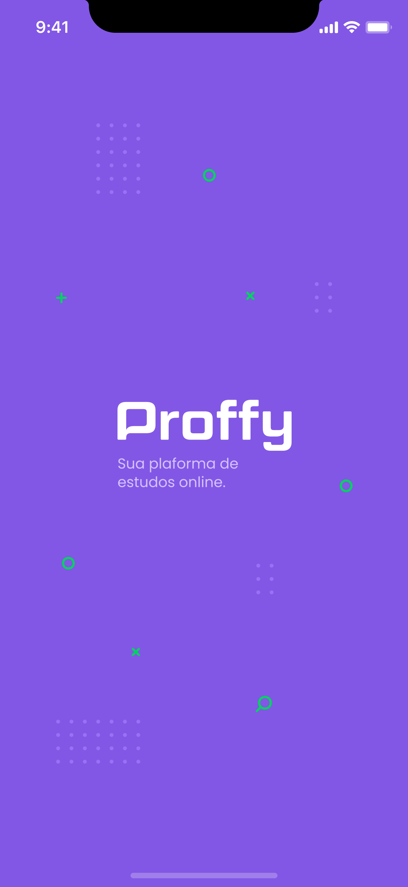

<h1 align="center">
    
</h1>

<p align="center">
  <a href="#rocket-tecnologias">Tecnologias</a>&nbsp;&nbsp;&nbsp;|&nbsp;&nbsp;&nbsp;
  <a href="#-projeto">Projeto</a>&nbsp;&nbsp;&nbsp;|&nbsp;&nbsp;&nbsp;
  <a href="#-layout">Layout</a>&nbsp;&nbsp;&nbsp;|&nbsp;&nbsp;&nbsp;
  <a href="#-funcionalidades">Funcionalidades</a>&nbsp;&nbsp;&nbsp;|&nbsp;&nbsp;&nbsp;
  <a href="#-como-rodar">Como rodar</a>&nbsp;&nbsp;&nbsp;|&nbsp;&nbsp;&nbsp;
  <a href="#memo-licença">Licença</a>
</p>

<p align="center">
 

  
</p>

<br>

<p align="center">
  
</p>

### Mobile Screenshot

<div style="display: flex; flex-direction: 'row';">
   
   
   
   
</div>

## 🚀 Tecnologias

Esse projeto foi desenvolvido com as seguintes tecnologias:

- [Node.js](https://nodejs.org/en/)
- [React](https://reactjs.org)
- [React Native](https://facebook.github.io/react-native/)
- [Expo](https://expo.io/)

## 💻 Projeto

O Proffy é uma plataforma de estudos online que ajuda pessoas a encontrarem professores online.

## 🔖 Layout

Nos links abaixo você encontra o layout do projeto web e também do mobile. Lembrando que você precisa ter uma conta no [Figma](http://figma.com/) para acessá-lo.

- [Layout Web](https://www.figma.com/file/GHGS126t7WYjnPZdRKChJF/Proffy-Web)
- [Layout Mobile](https://www.figma.com/file/e33KvgUpFdunXxJjHnK7CG/Proffy-Mobile)

## 🚀 Funcionalidades

- Site para cadastro de estudante e professores.
- App para conectar estudantes e professores.

## 👷 Como rodar

```bash
# Clone o Repositório
$ git clone https://github.com/jose-bone/proffy.git
```

### 📦 Rode a API

```bash
# Vá para a pasta do servidor
$ cd proffy/server

# Instale as dependências
$ yarn install

# Rode a aplicação
$ yarn start
```

Acesse a API: http://localhost:3333/

### 💻 Rode o Project Web

```bash
# Vá para a pasta web
$ cd proffy/web

# Instale as dependências
$ yarn install

# Rode a aplicação
$ yarn start
```

Acesse: http://localhost:3000/ para ver o resultado.

### 📱 Run Mobile Project

Para rodar o projeto mobile você precisa de um celular com o [expo](https://play.google.com/store/apps/details?id=host.exp.exponent) instalado ou um emulador android/ios.

```bash
# Vá para a pasta mobile
$ cd proffy/mobile

# Instale as dependências
$ yarn install

# Rode a aplicação
$ yarn start
```

Depois leia o QRCode com o app do [expo](https://play.google.com/store/apps/details?id=host.exp.exponent) ou rode em um emulador.

## 🐛 Problemas

Fique a vontade **para criar uma nova issue** com o respetivo titulo e descrição na página de issues do [Proffy](https://github.com/jose-bone/proffy/issues) Repositório. Se você já encontrou a solução para o problema, **Eu amaria fazer o review do seu pull request**!

## 📝 Licença

Esse projeto está sob a licença MIT. Veja o arquivo [LICENSE](LICENSE.md) para mais detalhes.

---

Feito com 💜 by José Boné 👋
